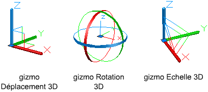

|*Doc. #*|*Rédacteur*|*Création*|*Mise à jour*|
|:---:|:---:|---:|:---|
|***0026***|*Loïc Drouet*|_Mercredi 13 novembre 2024_|_Jeudi 28 novembre 2024_|

# AutoCAD Basics

## 1. AutoCAD Commands

|#|Français|English|Raccourci|Action|
|:---:|:---:|:---:|:---:|:---|
|01|`GRILLE`|`GRID`|---|Affiche un motif de grille dans la fenêtre courante.|
|02|`CALQUE`|`LAYER`|`LA`|Gère les calques et leurs propriétés.|
|03|`LIGNE`|`LINE`|`L`|Crée une série de segments de ligne contigus, dont chaque segment est un objet ligne modifiable séparément.|
|04|`POLYLIGN`|`PLINE`|`PL`|Crée une polyligne 2D, un objet unique composé de segments de ligne et d'arc.|
|05|`RECTANG`|`RECTANG`|---|Crée une polyligne rectangulaire.|
|06|`CERCLE`|`CIRCLE`|`C`|Crée un cercle.|
|07|`CYLINDRE`|`CYLINDER`|`CYL`|Crée un cylindre solide 3D.|
|08|`PAN`|`PAN`|`P`|Panoramique. Déplace la vue sans modifier sa direction ou son zoom.|
|09|`ORTHO`|`ORTHO`|`F8`|Limite le mouvement du curseur à l'horizontale ou à la verticale.|
|10|`DECALER`|`OFFSET`|`O`|Crée des cercles concentriques, des lignes parallèles et des courbes parallèles.|
|11|`MIROIR`|`MIRROR`|`MI`|Crée une copie en miroir des objets sélectionnés.|
|12|`PROLONGE`|`EXTEND`|`EX`|Étend les objets pour qu'ils touchent les arêtes des autres objets.|
|13|`DECOMPOS`|`EXPLODE`|`X`|Décompose un objet afin d'obtenir les différents objets dont il est constitué.|
|14|`AJUSTER`|`TRIM`|`TR`|Ajuste les objets pour qu'ils touchent les arêtes des autres objets.|
|15|`ROTATION`|`ROTATE`|`RO`|Fait pivoter les objets autour d'un point de base.|
|16|`ROTATION3D`|`ROTATE3D`|---|Dans une vue 3D, affiche le gizmo Rotation 3D pour faire pivoter les objets 3D autour d'un point de base.|
|17|`REVOLUTION`|`REVOLVE`|`REV`|Crée une surface ou un solide 3D par balayage d'un objet autour d'un axe.|
|18|`ECHELLE`|`SCALE`|`SC`|Agrandit ou réduit des objets sélectionnés en conservant leurs proportions après la mise à l'échelle.|
|19|`REGEN`|`REGEN`|`RE`|Régénère le dessin depuis la fenêtre courante.|
|20|`SCU`|`UCS`|---|Définit l'origine et l'orientation du système de coordonnées utilisateur (SCU) courant.|
|21|`REPERE`|`PLAN`|---|Affiche une vue isométrique du plan XY du système de coordonnées utilisateur spécifié.|
|22|`MESURER`|`MEASURE`|`ME`|Crée des objets ou des blocs point en les espaçant selon des intervalles spécifiés sur la longueur ou le périmètre d'un objet.|
|23|`MEASUREGEOM`|`MEASUREGEOM`|`MEA`|Mesure la distance, le rayon, l'angle, l'aire et le volume d'objets sélectionnés, de séquences de points, ou de façon dynamique.|
|24|`DISTANCE`|`DIST`|`DI`|Mesure la distance et les angles définis par deux points.|
|25|`ETAT`|`STATUS`|---|Affiche des statistiques de dessin, des modes et des étendues.|
|26|`MISENPAGE`|`PAGESETUP`|---|Détermine la mise en page, le périphérique de traçage, le format de papier et autres paramètres utilisés pour toute nouvelle présentation.|
|27|`ID`|`ID`|---|DAffiche les valeurs de coordonnées SCU de l'emplacement spécifié.|
|28|`APPLOAD`|`APPLOAD`|---|Charge et décharge des applications et détermine les applications à charger au démarrage.|
|29|`VLISP (VLIDE)`|`VLISP (VLIDE)`|---|Affiche l'environnement de développement AutoLISP.|

---
___Sources___
- [Liste de commandes francais / anglais](https://cadxp.com/topic/6654-liste-de-commandes-francais-vs-anglais/)
- [AutoCAD commands dictionary](https://www.cadforum.cz/en/command.asp)
- [AUTODESK AutoCAD 2025](https://help.autodesk.com/view/ACD/2025/FRA/)
---

## 2. AutoCAD Variables

|#|Variable|Valeur|Action|
|:---:|:---:|:---:|:---:|
|01|`LISPSYS`|`0`|Gérer / Éditeur Visual LISP : Ouvre __Visual LISP pour AutoCAD__|
|02|`LISPSYS`|`1`|Gérer / Éditeur Visual LISP : Ouvre __Visual Studio Code (AutoCAD AutoLISP Extension)__|
|03|`LISPSYS`|`2`|Gérer / Éditeur Visual LISP : Ouvre __Visual Studio Code (AutoCAD AutoLISP Extension)__|

---
___Sources___
- [Les webinaires de la communauté : Initiation à AutoLISP - [VLIDE]](https://youtu.be/aM-sLlztIjU?si=FcyCOmkpM7zRLu-T&t=546)
- [AUTODESK AutoCAD 2025 - [VLISP (commande)]](https://help.autodesk.com/view/ACD/2025/FRA/?guid=GUID-5601ACC6-C4F6-4375-9C2C-3DBCAE2880B1)
---

## 3. Notes

### 3.1 Les macros par rapport au LISP

Les macros utilisent le langage DIESEL pour une automatisation des tâches, mais le DIESEL reste très limité par rapport au LISP.

---
___Sources___
- [Les webinaires de la communauté : Initiation à AutoLISP - [Macros / DIESEL /LISP]](https://youtu.be/aM-sLlztIjU?si=_SXlUYy6H1SpLK42&t=1905)
---

### 3.2 Utilisation de gizmos 3D (gizmo est synonyme de gadget) 

Les gizmos 3D vous permettent de déplacer, faire pivoter ou redimensionner un jeu d'objets selon un axe ou un plan 3D.

__Mode d'utilisation des gizmos__

Il existe trois types de gizmos :
- __Gizmo Déplacement 3D__ : déplace les objets sélectionnés selon un axe ou un plan.
- __Gizmo Rotation 3D__ : fait pivoter les objets sélectionnés selon un axe spécifié.
- __Gizmo Echelle 3D__ : redimensionne les objets sélectionnés selon un axe ou un plan spécifié, ou uniformément selon les trois axes.



---
___Sources___
- [Utilisation de gizmos 3D](https://help.autodesk.com/view/ACD/2025/FRA/?guid=GUID-7BD066C9-31BA-4D47-8064-2F9CF268FA15)
---

### 3.3 Underscore devant les commandes anglaises

Placer un underscore (_) devant les commandes anglaises permet à AutoCAD français par exemple, de les interpréter.

Exemple :
```
    _LINE
    signifie
    LIGNE
    dans un AutoCAD français.
```

---
___Sources___
- [Les webinaires de la communauté : Initiation à AutoLISP - [Undersscore devant les commandes anglaises]](https://youtu.be/aM-sLlztIjU?si=FtfUk1ET6yO0g471&t=2860)
---

